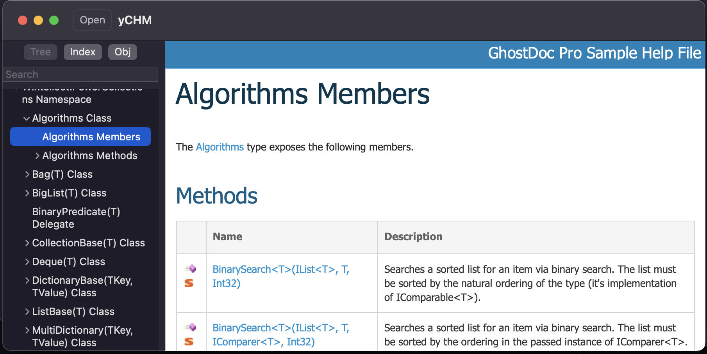

yCHM 
=========

Yet another CHM reader based on CHMLib. Under active but slow development as I only invest a few hours each week on this project.

# Acknowledgement

[Unofficial (Preliminary) HTML Help Specification](http://www.nongnu.org/chmspec/latest/)

[CHMLib](https://github.com/jedwing/CHMLib)
